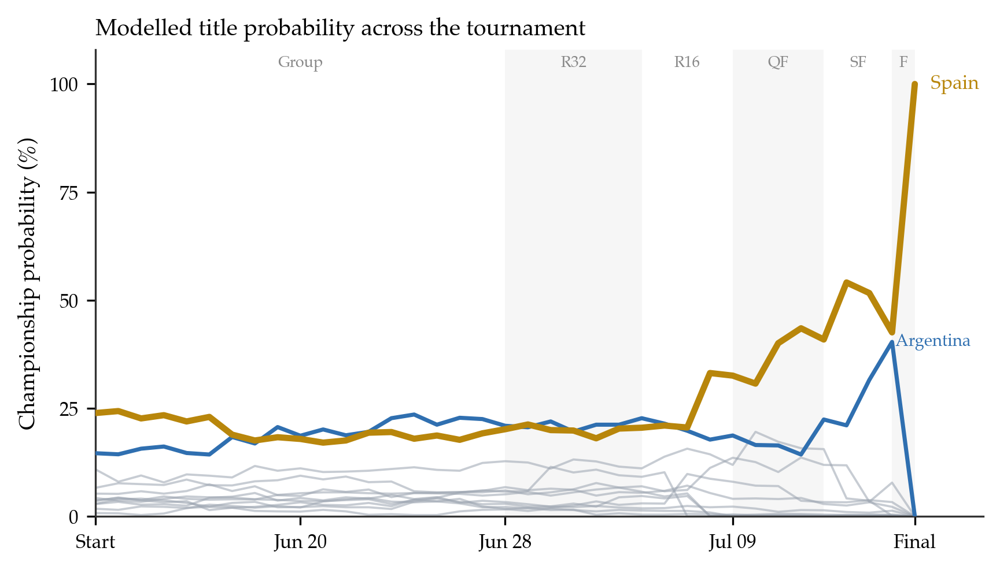
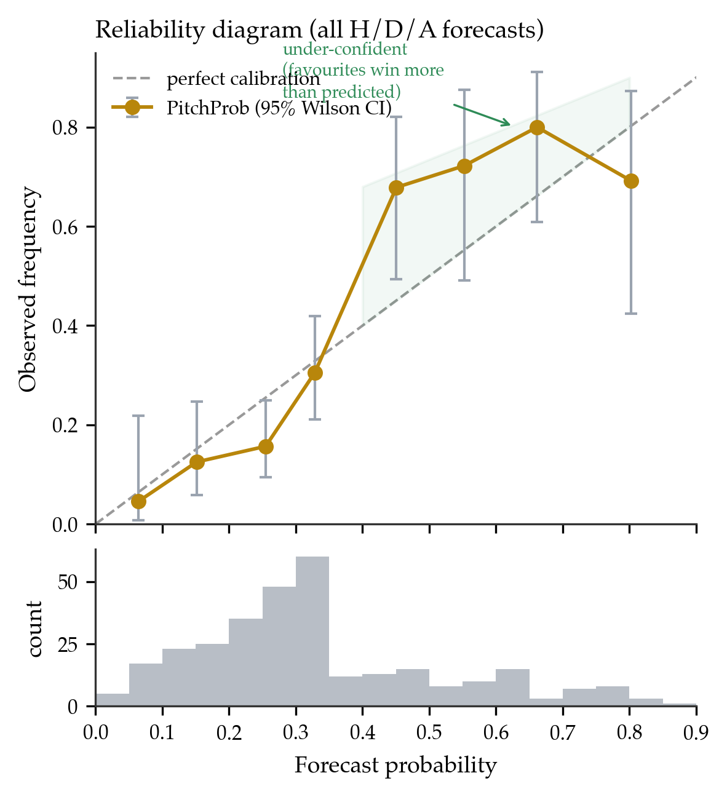
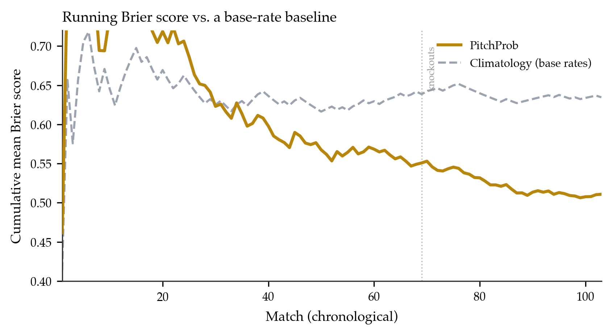
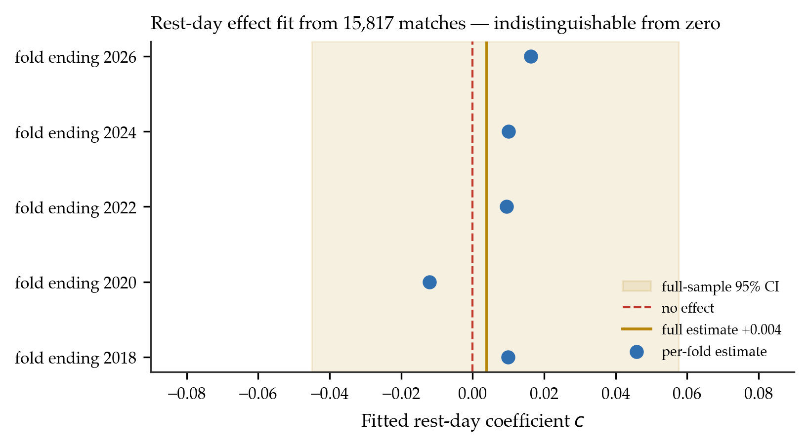
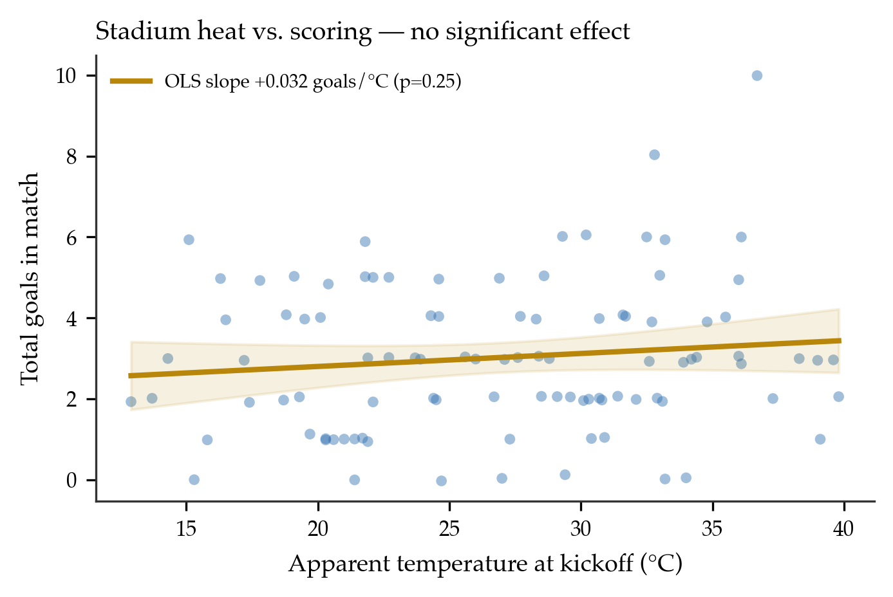

# Predicting the 2026 World Cup in Public: A Pre-Registered Evaluation of an Elo–Poisson Forecasting Model and a Null Result for Match-Context Adjustments

**Rana Usman**
Independent researcher · pitchprob.xyz · usmanashrafrana@gmail.com

---

*"All that I know most surely about morality and obligations, I owe to football."*
— Albert Camus

## Abstract

Public football forecasts are seldom pre-registered: they are typically reported after outcomes are known, are not timestamped, and can be revised or selectively highlighted, which frustrates honest evaluation. We describe a deliberately auditable alternative. For all 104 matches of the 2026 FIFA World Cup, a live system committed a full win/draw/loss probability vector and a most-likely scoreline *before each kickoff*, timestamped to an append-only, publicly mirrored log (810 snapshots). The forecaster composes an importance-weighted Elo rating (estimated on 49,405 international matches, 1872–2026), a bivariate-Poisson goal model with a Dixon–Coles low-score correction, and a Monte Carlo simulation of the remaining tournament. On the 103 matches with a matched pre-kickoff forecast, three-way accuracy was 63.1% (Wilson 95% CI [0.535, 0.718]). Against a climatological base-rate reference the model showed positive skill on every proper score — Brier skill score +0.195, ranked-probability skill score +0.277, logarithmic skill +0.174 — and a Wilcoxon signed-rank test on per-match Brier scores rejects equality with the reference at $p \approx 3\times10^{-5}$. A Murphy decomposition attributes the Brier score to low reliability (0.013) and substantial resolution (0.066); the reliability diagram indicates mild *under*-confidence, this tournament having produced fewer upsets than the forecasts implied. We then test whether the model's match-context adjustments (heat, rest, travel) carry usable signal by *estimating* rather than assuming them. A rest-day differential fit on 15,817 historical matches yields a coefficient indistinguishable from zero (bootstrap 95% CI [−0.045, +0.058]) with no out-of-sample improvement in blocked cross-validation or on the held-out World Cup; stadium temperature shows no detectable effect and a sign opposite to the assumed adjustment. We report these as robust nulls at the resolution one tournament affords. The contribution is not a new method but a transparent, reproducible evaluation protocol — commit, log publicly, report the nulls — which we advocate as a lightweight standard for public sports forecasting.

**Keywords:** probabilistic forecasting; pre-registration; Elo ratings; bivariate Poisson; forecast verification; calibration; negative results; association football

---

## 1. Introduction

Probabilistic match forecasts are ubiquitous, but they are rarely subjected to the discipline that quantitative forecasting in other domains takes for granted. Weather and climate services publish forecasts prospectively and verify them against fixed scoring rules; clinical and psychological research increasingly pre-registers hypotheses and analyses to guard against hindsight and selective reporting. Public football prediction, by contrast, is usually retrospective: a model's "hit rate" is quoted after the tournament, the predictions themselves are not timestamped, and there is no external record against which selective emphasis can be checked.

This paper reports an attempt to hold a single model to the stricter standard. For the 2026 FIFA World Cup we deployed a live forecasting system that wrote a complete, timestamped prediction for every match to an append-only server-side log *before kickoff*, and mirrored those predictions publicly during the tournament. Every performance claim below is therefore checkable against a record that provably predates the results.

We make three contributions. First, a **pre-registered tournament evaluation**: predictive skill and calibration measured against frozen forecasts using proper scoring rules and skill scores relative to a climatological reference, with confidence intervals and a significance test, not a bare accuracy figure. Second, a **fitted-versus-assumed test of match-context adjustments**: the deployed model nudged each match for stadium heat, rest days, and travel; we ask whether these features carry signal by estimating the strongest candidate on historical data and evaluating out-of-sample. Both the fitted rest-day effect and a descriptive analysis of temperature are null. Third, an **open, reproducible artifact**: the 810-snapshot forecast log, results, and analysis code are released.

We state plainly what this work is not. The forecaster is a composition of standard, decades-old components; we claim no methodological novelty in the model itself. A single 104-match tournament is a small sample, and our point estimates carry real uncertainty, which we quantify throughout rather than paper over. The value is in the protocol and in the honesty of the reporting — including the parts that failed.

## 2. Related work

**Ratings and goal models.** Elo's rating system [Elo 1978], devised for chess, has been adapted to association football with importance weighting and margin-of-victory scaling; Hvattum and Arntzen [2010] evaluate Elo-derived covariates for match prediction and find them competitive with market-based alternatives. Independently, Maher [1982] modelled goal counts as (near-)independent Poisson variates driven by team attack and defence parameters; Dixon and Coles [1997] added a dependence correction for low scores and a time-decay weighting, a template still standard in the literature. Karlis and Ntzoufras [2003] develop the bivariate-Poisson treatment directly. Our forecaster uses these components essentially unmodified.

**Tournament simulation.** Producing lift-the-trophy probabilities requires simulating the remaining fixtures; Monte Carlo propagation of a match model through a bracket is standard practice in both academic and popular forecasting. The simulation here follows that pattern, adding the 2026 format's expanded bracket and best-third-placed allocation.

**Forecast verification.** Evaluation draws on the meteorological verification literature: the Brier score [Brier 1950] and its reliability–resolution–uncertainty decomposition [Murphy 1973], the ranked probability score [Epstein 1969] appropriate for ordered outcomes, the logarithmic score, and reliability diagrams. Constantinou and Fenton [2012] argue specifically for the RPS in football because outcomes are ordinal (home ≻ draw ≻ away). We adopt these tools and, following standard practice, report *skill scores* against a climatological reference rather than raw scores alone.

**Transparency and negative results.** Pre-registration and the reporting of null findings are established correctives to selective reporting in the experimental sciences but are uncommon in public sports modelling. This paper imports the former (a committed, timestamped forecast) and foregrounds the latter (a pre-specified hypothesis — context adjustments help — that the data did not support).

## 3. Data

**Historical results.** We use an open dataset of 49,405 completed men's international matches from 30 November 1872 to 10 June 2026 (`martj42/international_results`): date, teams, score, competition, host city and country, and a neutral-venue indicator. Analyses requiring dense modern coverage restrict to 2010 onward (15,817 matches).

**Live tournament feed.** Fixtures, live scores, venues, and final results were read from the public ESPN scoreboard API and cached server-side each minute.

**Weather.** Forecast apparent temperature and precipitation at each stadium and kickoff hour were obtained from the Open-Meteo API.

**The pre-registered forecast log.** A scheduled server-side job wrote, every 30 minutes, a snapshot for each match within 48 hours of kickoff: rating inputs, context adjustments, expected goals, the $(\hat p_H, \hat p_D, \hat p_A)$ probability vector, the argmax pick, and the modal scoreline, each carrying a UTC timestamp. Completed matches were appended to a results log. This produced 810 prediction snapshots and 104 results. For evaluation we take, per match, the **last snapshot timestamped strictly before kickoff** as the frozen forecast; 103 of 104 matches have such a forecast (one opening fixture preceded the logger's first run).

## 4. Model

### 4.1 Ratings

Each team $i$ carries a rating $R_i$ updated after every historical match. With home advantage $h=80$ Elo points (set to $0$ at neutral venues), the home team's expected score is
$$ E_H = \frac{1}{1 + 10^{-(R_H + h - R_A)/400}}, $$
and ratings update by
$$ R_H \leftarrow R_H + K\,\mu(|g_H-g_A|)\,(S_H - E_H), \qquad R_A \leftarrow R_A - K\,\mu(\cdot)\,(S_H - E_H), $$
where $S_H\in\{1,\tfrac12,0\}$ encodes the result, $g_H,g_A$ are goals, and $\mu$ is a margin-of-victory multiplier ($\mu=1$ for a one-goal margin, $1.5$ for two, $(11+d)/8$ for a $d$-goal margin, $d>2$). The update weight $K$ is importance-scaled by competition: $60$ for World Cup matches, $40$–$50$ for continental championships and qualifiers, $20$ for friendlies. Ratings are swept once through the full history in chronological order.

### 4.2 Goal and outcome model

The pre-match rating difference $x = (R_H + h - R_A)/400$ maps to expected goals
$$ \lambda_H = \exp(a + b\,x), \qquad \lambda_A = \exp(a - b\,x). $$
Scorelines follow a Poisson product with the Dixon–Coles low-score correction: for goals $(u,v)$,
$$ P(u,v) \propto \tau(u,v;\lambda_H,\lambda_A,\rho)\,\frac{\lambda_H^{u}e^{-\lambda_H}}{u!}\,\frac{\lambda_A^{v}e^{-\lambda_A}}{v!}, $$
with $\tau$ inflating/deflating the four lowest scorelines by $\rho$:
$$ \tau(0,0)=1-\lambda_H\lambda_A\rho,\ \tau(0,1)=1+\lambda_H\rho,\ \tau(1,0)=1+\lambda_A\rho,\ \tau(1,1)=1-\rho, $$
and $\tau=1$ otherwise. Outcome probabilities $(\hat p_H,\hat p_D,\hat p_A)$ are obtained by summing $P(u,v)$ over the relevant half-planes of a truncated $11\times11$ grid.

### 4.3 Estimation

The global parameters $(a,b,\rho)$ were fit before the tournament by maximising the time-weighted Poisson log-likelihood
$$ \ell(a,b) = \sum_{m} w_m\big[(g_{H,m}\log\lambda_{H,m}-\lambda_{H,m}) + (g_{A,m}\log\lambda_{A,m}-\lambda_{A,m})\big], $$
over internationals since 2015 with exponential recency weights $w_m$, and $\rho$ selected by walk-forward Brier score; the deployed values were $a=0.164$, $b=0.754$, $\rho=-0.12$. These were frozen before the World Cup.

### 4.4 Tournament simulation

Round-by-round and championship probabilities come from $N=10{,}000$ Monte Carlo replicates of the remaining tournament (Algorithm 1). Unplayed group matches are sampled from the goal model; groups are ranked by the competition's tiebreakers; the eight best third-placed teams are allocated to bracket slots by constraint satisfaction; knockouts are resolved with extra time and, if level, a penalty shootout modelled as a near–coin-flip with a mild rating tilt. Completed matches are held fixed, so the distribution updates automatically as results arrive.

> **Algorithm 1 (tournament replicate).** (1) For each unplayed group match, draw $(u,v)$ from the goal model; accumulate points and goal difference. (2) Rank each group; collect winners, runners-up, and the eight best third-placed teams. (3) Assign third-placed teams to bracket slots by backtracking over the format's allocation constraints. (4) Play the bracket: at each tie, if a real result exists use it, else draw a scoreline; resolve level knockouts by extra time then shootout. (5) Record the champion and the round reached by every team. Aggregate over $N$ replicates.

### 4.5 Context adjustments (the object of Section 8)

The deployed model additionally perturbed each match by stadium heat (apparent temperature above $26^\circ$C reducing $\lambda$ and compressing $x$), a rest-day differential, and inter-venue travel distance. Crucially, these adjustments were set from qualitative priors, *not* estimated — motivating the test in Section 8.

## 5. Pre-registration protocol

The forecast for a match is defined as its last logged snapshot with a UTC timestamp strictly earlier than kickoff. Because ratings update only at full time, this snapshot depends only on pre-match information. Snapshots are append-only and were mirrored publicly during the tournament. All evaluation below uses these frozen forecasts; no forecast was recomputed after its match, and the metrics (Section 6) were fixed in advance. This is the operational sense of "pre-registered": both the predictions and the planned scoring existed before the outcomes.

## 6. Evaluation methodology

Let a forecast be $\mathbf{\hat p}=(\hat p_H,\hat p_D,\hat p_A)$ and the realised outcome $\mathbf{o}$ a one-hot vector. We report:

- **Accuracy:** the rate at which $\arg\max\mathbf{\hat p}$ matches the result, with a Wilson score interval.
- **Brier score** [Brier 1950]: $\mathrm{BS}=\frac1n\sum_m\lVert\mathbf{\hat p}_m-\mathbf{o}_m\rVert_2^2$.
- **Ranked probability score** [Epstein 1969], for the ordered outcome $H\succ D\succ A$: $\mathrm{RPS}=\frac1n\sum_m\frac{1}{2}\sum_{k=1}^{2}\big(\textstyle\sum_{j\le k}\hat p_{m,j}-\sum_{j\le k}o_{m,j}\big)^2$.
- **Logarithmic score:** $\mathrm{LS}=-\frac1n\sum_m\log \hat p_{m,\,y_m}$.
- **Skill scores** against a climatological reference $\mathbf{\bar p}$ (the empirical base rates $H{=}0.48,D{=}0.23,A{=}0.29$): $\mathrm{SS}=1-\mathrm{score}_{\text{model}}/\mathrm{score}_{\text{ref}}$; positive values indicate improvement over always issuing the base rates. Because the reference uses the tournament's own realised frequencies — information the model did not have — this choice favours the reference, making the reported skill conservative.
- **Murphy decomposition** [Murphy 1973] of the Brier score into reliability, resolution, and uncertainty, $\mathrm{BS}=\mathrm{REL}-\mathrm{RES}+\mathrm{UNC}$, with reliability and resolution estimated on $K=10$ probability bins.
- **Reliability diagram** with per-bin Wilson intervals and a forecast-sharpness histogram.

To test whether the model outperforms the reference beyond chance we apply a Wilcoxon signed-rank test to the paired per-match Brier scores (model vs. climatology).

## 7. Results

### 7.1 Predictive skill

On the 103 matched forecasts the model's argmax matched the result in 65 cases, an accuracy of **63.1%** (Wilson 95% CI **[53.5%, 71.8%]**); the realised outcome mix was 48% home, 23% draw, 29% away, against which an always-home rule scores 47.6% and a uniform guess 33.3%. On proper scores the model beats the climatological reference on every metric (Table 1), with a Brier skill score of **+0.195**, an RPS skill score of **+0.277**, and a logarithmic skill of **+0.174**. The paired Wilcoxon test on per-match Brier scores rejects equality with the reference at $p\approx3\times10^{-5}$, so the improvement is not attributable to sampling noise even though the accuracy interval is wide. Figure 3 shows the running Brier score tracking below the reference throughout, with the gap widening across the knockout stage. Accuracy was higher in the knockouts (25/34, 73.5%) than the group stage (58.0%), consistent with reduced team-selection noise once qualification is settled.

*Table 1. Predictive performance on 103 pre-registered forecasts. Lower is better for BS, RPS, LS; skill scores are relative to the climatological base-rate reference.*

| Metric | Model | Reference | Skill |
|---|---|---|---|
| Accuracy | 0.631 (95% CI 0.535–0.718) | 0.476 | — |
| Brier score | 0.511 | 0.635 | +0.195 |
| Ranked probability score | 0.165 | 0.228 | +0.277 |
| Logarithmic score | 0.869 | 1.052 | +0.174 |

*Figure 1. Modelled championship probability for each team at every stage, reconstructed by re-simulating the remaining tournament from the results known at that date. Spain (gold) opened as favourite, fell to 17% as the group stage tightened, and climbed through the knockouts to lift the trophy; Argentina (blue) is the runner-up. Grey lines are all other qualifiers.*

### 7.2 Calibration

Pooling all 309 forecast–outcome pairs and binning by predicted probability yields the reliability diagram of Figure 2. The Murphy decomposition — computed on the pooled binary forecasts, whose mean Brier of $0.170$ is one third of the three-component vector score — gives reliability $0.013$ (near zero is good), resolution $0.066$, and uncertainty $0.222$; the small reliability term confirms the forecasts are close to calibrated, and the substantial resolution confirms they are informative rather than hedged toward the base rate. The residual miscalibration is directional: in the upper bins the curve sits *above* the diagonal — outcomes assigned 40–50%, 50–60%, and 60–75% occurred 68%, 72%, and 80% of the time — i.e. the model was mildly **under**-confident in favourites. The most economical reading is that this particular tournament produced fewer upsets than the forecasts implied; with 103 matches the per-bin intervals are wide, and we report the direction rather than a precise miscalibration magnitude.

*Figure 2. Reliability diagram for all H/D/A forecasts, with per-bin 95% Wilson intervals; the lower panel shows forecast sharpness. Points above the diagonal in the upper range indicate mild under-confidence in favourites.*

*Figure 3. Cumulative mean Brier score over the 103 matches in chronological order, model versus the climatological base-rate reference. The model's curve stays below the reference throughout and separates further across the knockout stage.*

### 7.3 Tournament-level forecasts and notable calls

Figure 1 traces each team's modelled title probability across the tournament. The pre-tournament rating order placed Spain first and Argentina second; these two contested the final, Spain winning 1–0. Weeks before the knockout stage the pairing Spain–Argentina was the model's single most-likely final at 19.7% of 62 possible pairings, and the model favoured Spain within that matchup (51%). We report these as illustrative, not as evidence of skill beyond the aggregate scores of Section 7.1: single-tournament realisations are high-variance, and one correct final is one Bernoulli draw.

## 8. Does a fitted context layer help?

The deployed context adjustments (Section 4.5) were assumed, not estimated. A fair test of whether match context carries usable signal is to *learn* the effect from data and evaluate it out-of-sample. We do so for the rest-day differential — the one context feature cleanly reconstructable across the whole historical dataset — and analyse stadium temperature descriptively on the tournament. (Inter-venue travel is specific to one host geography and has no analogue in the heterogeneous historical fixture list; we leave it as future work.)

### 8.1 Fitted rest-day differential

For each match we compute each side's days since its previous fixture (capped at 14) and the home-minus-away differential $r$ (scaled to $[-1,1]$). We augment the goal model with a rest term,
$$ \lambda_H = \exp(a + b\,x + c\,r), \qquad \lambda_A = \exp(a - b\,x - c\,r), $$
and estimate $c$ by Poisson maximum likelihood on training data only. We evaluate two ways. First, **blocked (expanding-window) cross-validation** over 2010–2026 (15,817 matches, five time-ordered folds): adding the fitted term changed mean out-of-sample Brier by $+0.0001$ ($0.5156\to0.5157$) and log loss by $+0.0001$, and the fitted coefficient was small and *sign-unstable* across folds ($+0.010,-0.012,+0.009,+0.010,+0.016$). Second, a **held-out test on the World Cup**: fitting $c$ on all pre-tournament history and scoring the 103 tournament forecasts left the Brier score unchanged to four decimal places ($|\Delta|<10^{-4}$). A full-history fit gives $\hat c=+0.004$ with a bootstrap 95% CI of **[−0.045, +0.058]** (Figure 4), comfortably spanning zero. Whether assumed or optimally estimated, the rest-day differential yields no measurable forecasting improvement.

*Figure 4. The rest-day coefficient $c$, fit on 15,817 historical matches. Per-fold cross-validation estimates (points) scatter around zero and flip sign; the full-sample estimate (gold line) and its bootstrap 95% CI (band) straddle zero (red dashed).*

### 8.2 Stadium temperature (descriptive)

Among the 98 tournament matches with a logged apparent temperature (13–40°C, mean 26.9°C), higher temperature was not significantly associated with fewer goals; the ordinary-least-squares slope was $+0.032$ goals per °C ($p=0.25$; Figure 5) — the *opposite* sign to the deployed heuristic, which reduced expected goals in heat. Heat was likewise not associated with upsets (favourite win rate 55% in matches $\ge28$°C vs. 71% below; $p=0.68$). With one tournament and $n\approx100$ no temperature effect is detectable, and even the assumed direction of the hand-set adjustment was unsupported in-sample.

*Figure 5. Total goals against kickoff apparent temperature for 98 World Cup matches, with OLS fit and 95% confidence band (points jittered vertically). The slope is small, non-significant, and positive — contrary to the assumption that heat suppresses scoring.*

### 8.3 Interpretation

A rest coefficient statistically indistinguishable from zero, no out-of-sample gain, and no detectable temperature effect together make the context layer's contribution a robust null at the available resolution. This does not prove conditions never matter; it shows that, for results-only international-match forecasting, any such signal lies below what the rating already captures and below what these samples can resolve. The concrete lesson is that the model's most elaborate features added nothing — and the pre-registered record made that impossible to omit.

## 9. Discussion and limitations

The evidentiary ceiling is a single tournament (103 forecasts) plus a historical fitting set. Aggregate tournament metrics are one realisation of a high-variance process; the accuracy interval [53.5%, 71.8%] is deliberately wide, and readers should weight the skill-score comparison and its significance test — which pool information across matches — above the raw accuracy. The forecaster is a standard composition and is not itself a contribution. It uses results and scores only, with no lineup, injury, suspension, or shot-level expected-goals information, capping attainable accuracy; the observed ≈63% is consistent with the practical ceiling for results-only models. Travel could not be tested historically. The calibration analysis pools H/D/A forecasts, which are not independent within a match, so the per-bin intervals are somewhat optimistic. Finally, the fitted-context analysis addresses a linear rest-day term and a univariate temperature effect; richer non-linear or interaction effects are not excluded, only shown to be undetectable at this scale.

## 10. Conclusion

We deployed a standard football forecasting model for the 2026 World Cup under a pre-registration protocol: every prediction was timestamped and publicly logged before kickoff. The model performed in line with its backtest and showed positive, statistically significant skill over a climatological reference on Brier, ranked-probability, and logarithmic scores, while being mildly under-confident on a low-upset tournament. A direct test of its match-context adjustments — estimating a rest-day effect on 15,817 historical matches and analysing stadium temperature — returned robust null results, one contradicting the assumed sign of the deployed adjustment. The contribution is not a better model but a more accountable one: a fully auditable tournament forecast, evaluated against a record that predates the outcomes, with its failures reported alongside its successes. We offer the protocol — commit, log publicly, and report the nulls — as a lightweight standard for public sports forecasting.

## Reproducibility

The pre-registered prediction log (810 snapshots), match results, historical rating inputs, figure-generation and experiment code (including fold dates and the bootstrap seed) are released at the project repository; the live system and its report are at pitchprob.xyz.

## Acknowledgements

Historical results by the maintainers of `martj42/international_results`; live results via ESPN; weather via Open-Meteo.

## References

Brier, G. W. (1950). Verification of forecasts expressed in terms of probability. *Monthly Weather Review*, 78(1), 1–3.
Constantinou, A. C., & Fenton, N. E. (2012). Solving the problem of inadequate scoring rules for assessing probabilistic football forecast models. *Journal of Quantitative Analysis in Sports*, 8(1).
Dixon, M. J., & Coles, S. G. (1997). Modelling association football scores and inefficiencies in the football betting market. *Journal of the Royal Statistical Society: Series C*, 46(2), 265–280.
Elo, A. E. (1978). *The Rating of Chessplayers, Past and Present.* Arco.
Epstein, E. S. (1969). A scoring system for probability forecasts of ranked categories. *Journal of Applied Meteorology*, 8(6), 985–987.
Hvattum, L. M., & Arntzen, H. (2010). Using ELO ratings for match result prediction in association football. *International Journal of Forecasting*, 26(3), 460–470.
Karlis, D., & Ntzoufras, I. (2003). Analysis of sports data by using bivariate Poisson models. *Journal of the Royal Statistical Society: Series D*, 52(3), 381–393.
Maher, M. J. (1982). Modelling association football scores. *Statistica Neerlandica*, 36(3), 109–118.
Murphy, A. H. (1973). A new vector partition of the probability score. *Journal of Applied Meteorology*, 12(4), 595–600.
